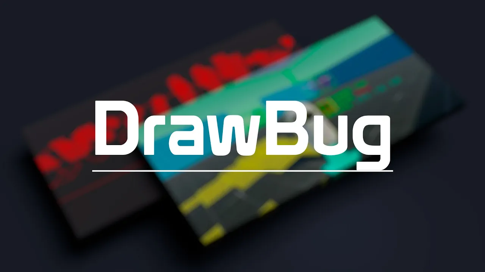

<h1 align="center">
    <a href="#"></a>
    <br />
</h1>

Install from Package Manager.
```
https://github.com/MasterSix997/DrawBug.git
```

## Disclaimer
This package is still in testing, being used and adjusted to meet production projects.
But feel free to use, modify and send suggestions.

## Features:
- [x] Draw wire shapes
- [x] Draw solid shapes
- [x] Drawings with duration
- [x] Work in Update/LateUpdate/FixedUpdate
- [x] Burst and jobs based

## To-do list:
- [ ] Text rendering
- [ ] Draw in Editor mode